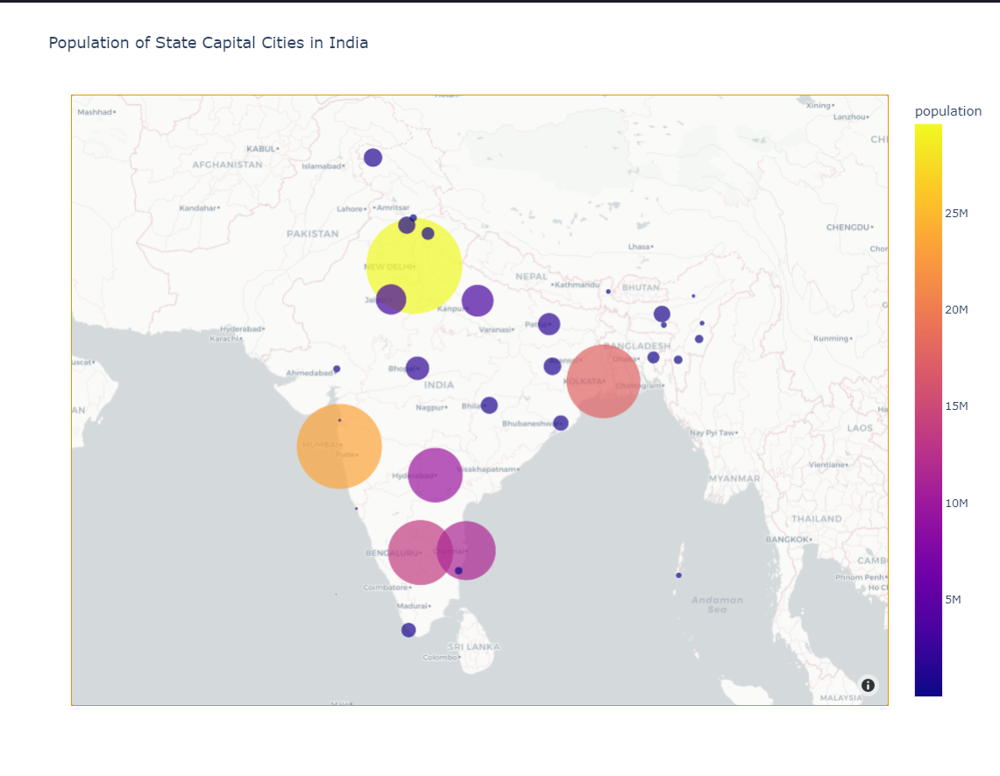
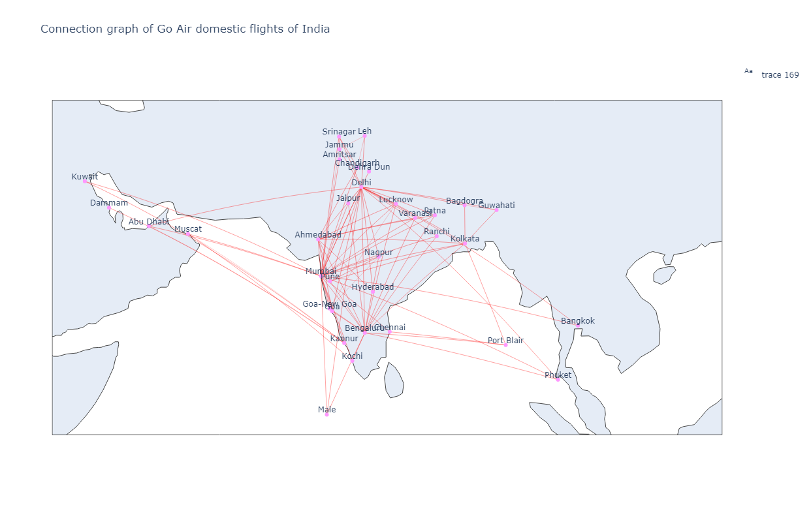

# Data visualisation lab 3

This repo is for the submission of the plots generated for this lab. plotly, geopy have been used here to plot the graphs

## Execution

To execute the code, you need to install plotly and geopy as dependencies and then execute the ipynb with the files attached in the repo.

## Question 1

The Graph is an interactive map which is used for better visualisation, you can hover over the bubbles here to view details related to it, moreover you can zoom in it too. The image of the graph is below.

## Question 2

The graph for question 2 is attached below

